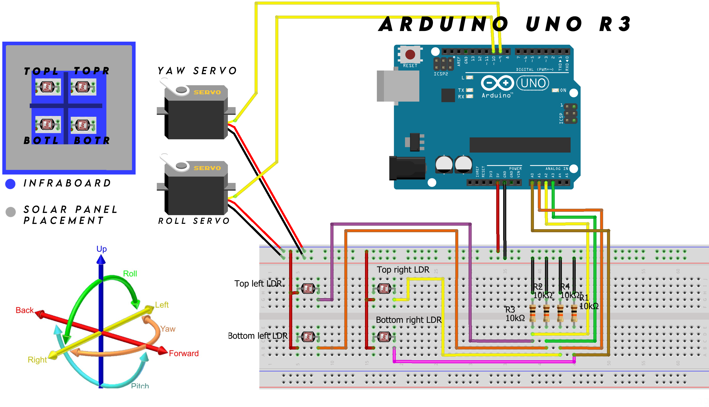

# Light Following Solar Tracker with PID Control

## Project Description

This project involves designing and building a light-following solar tracker system using a Proportional-Integral-Derivative (PID) controller. The primary objective of the system is to maximize the efficiency of a solar panel by ensuring it remains aligned with the light source, typically the sun, throughout the day.

## Software Requirements
- Arduino IDE

## Hardware Requirements
- Arduino board (I Use Arduino Uno R3)
- 4 Light Dependent Resistors (LDRs)
- 2 Servo Motors
- 4 Resistors (appropriate values for LDR voltage divider circuits, I use 10k Ohms)
- Connecting wires/jumper wires
- Breadboard
- Solar panel (for practical application)

## Circuit Diagram


### How It Works

The system uses four Light Dependent Resistors (LDRs) arranged around the solar panel to detect the intensity of light from different directions. The LDRs are positioned as follows:
- **Top right** (connected to analog pin A1)
- **Top left** (connected to analog pin A2)
- **Bottom right** (connected to analog pin A0)
- **Bottom left** (connected to analog pin A3)

These LDRs generate analog signals based on the amount of light they receive. The Arduino reads these signals to determine the direction of the light source.

Two servos are used to adjust the position of the solar panel:
- A **horizontal servo** (bottom servo) for Yaw movement
- A **vertical servo** (top servo) for Roll movement

The PID controller processes the difference in light intensity between the LDRs to minimize the error and adjust the servos accurately. The PID control parameters (proportional, integral, and derivative gains) are fine-tuned to ensure smooth and precise movement of the solar panel.

### Features
- **Automatic Light Tracking:** Continuously adjusts the position of the solar panel to face the light source.
- **PID Control:** Enhances the accuracy and stability of the tracking system.
- **Adjustable Sensitivity:** The light detection threshold can be adjusted to suit different lighting conditions.

### Specifications
- **Servo Motors:**
  - Horizontal servo range: 0 to 180 degrees
  - Vertical servo range: 0 to 180 degrees
- **PID Control Parameters:**
  - Horizontal PID:
    - Proportional gain (KpH): 0.1
    - Integral gain (KiH): 0.03
    - Derivative gain (KdH): 0
    - Sample time (TsH): 0.1 seconds
  - Vertical PID:
    - Proportional gain (KpV): 0.1
    - Integral gain (KiV): 0.03
    - Derivative gain (KdV): 0
    - Sample time (TsV): 0.1 seconds
- **Light Detection Threshold:** 50

### Benefits
- **Increased Efficiency:** By keeping the solar panel aligned with the sun, the system maximizes the amount of solar energy harvested.
- **Cost-Effective:** Uses readily available components and is easy to assemble.
- **Scalable:** Can be adapted for larger solar panels or more complex tracking systems.

## LDR Board 


## How it looks like


## Code

```cpp
#include <Servo.h>

Servo servohori; // Horizontal servo (BOTTOM SERVO)
Servo servoverti; // Vertical servo (TOP SERVO)

int servoh = 90; // Initial position of the horizontal servo
int servohLimitHigh = 180; // Maximum range of the servo is 180 degrees
int servohLimitLow = 0; // Minimum range of the servo is 0 degrees

int servov = 90; // Initial position of the vertical servo
int servovLimitHigh = 180; // Maximum range of the servo is 180 degrees
int servovLimitLow = 0; // Minimum range of the servo is 0 degrees

int ldrtopr = 3; // Top right LDR on pin A1
int ldrtopl = 0; // Top left LDR on pin A2
int ldrbotr = 2; // Bottom right LDR on pin A0
int ldrbotl = 1; // Bottom left LDR on pin A3

// PID variables for horizontal control
float KpH = 0.1; // Proportional gain
float KiH = 0.03; // Integral gain
float KdH = 0; // Derivative gain
float TsH = 0.1; // Sample time (s)

float errorH_prev = 0, integralH = 0;

// PID variables for vertical control
float KpV = 0.1; // Proportional gain
float KiV = 0.03; // Integral gain
float KdV = 0; // Derivative gain
float TsV = 0.1; // Sample time (s)

float errorV_prev = 0, integralV = 0;

// Threshold for light detection
int lightThreshold = 50;

void setup() {
  Serial.begin(9600); // Start serial communication at 9600 baud rate
  servohori.attach(10); // Horizontal servo connected to Arduino pin 10
  servohori.write(servoh);
  
  servoverti.attach(9); // Vertical servo connected to Arduino pin 9
  servoverti.write(servov);
  delay(500); // Delay to stabilize servos
}

void loop() {
  servoh = servohori.read();
  servov = servoverti.read();

  int topl = analogRead(ldrtopl); // Read analog values from top left LDR
  int topr = analogRead(ldrtopr); // Read analog values from top right LDR
  int botl = analogRead(ldrbotl); // Read analog values from bottom left LDR
  int botr = analogRead(ldrbotr); // Read analog values from bottom right LDR

  int avgtop = (topl + topr) / 2; // Average of top LDRs
  int avgbot = (botl + botr) / 2; // Average of bottom LDRs
  int avgleft = (topl + botl) / 2; // Average of left LDRs
  int avgright = (topr + botr) / 2; // Average of right LDRs

  // Calculate errors
  float errorH = avgleft - avgright;
  float errorV = avgtop - avgbot;

  // PID for horizontal servo
  integralH += errorH * TsH;
  float derivativeH = (errorH - errorH_prev) / TsH;
  float outputH = KpH * errorH + KiH * integralH + KdH * derivativeH;
  servoh = constrain(servoh + outputH, servohLimitLow, servohLimitHigh);
  servohori.write(servoh);
  errorH_prev = errorH;

  // PID for vertical servo
  integralV += errorV * TsV;
  float derivativeV = (errorV - errorV_prev) / TsV;
  float outputV = KpV * errorV + KiV * integralV + KdV * derivativeV;
  servov = constrain(servov + outputV, servovLimitLow, servovLimitHigh);
  servoverti.write(servov);
  errorV_prev = errorV;

  // Send LDR values to Serial Plotter
  Serial.print(topl);
  Serial.print(",");
  Serial.print(topr);
  Serial.print(",");
  Serial.print(botl);
  Serial.print(",");
  Serial.println(botr);
  Serial.print(outputV);
  Serial.print(",");
  Serial.println(outputH);
  Serial.print(",");
  delay(100); // Loop delay in milliseconds (equal to Ts)
}
